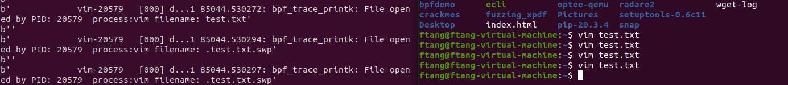

## setup
i'm using ubuntu 20.04
```
sudo apt-get install bpfcc-tools linux-headers-$(uname -r)
```

## 001 Hello World
```commandline
BPF(text='int kprobe__sys_clone(void *ctx) { bpf_trace_printk("Hello, World!\\n"); return 0; }').trace_print()
```


kprobe__sys_clone()： 这是通过kprobe进行内核函数动态跟踪的快捷方法。如果C语言函数名称以"kprobe__"作为前缀，则函数名其余部分则表示将要被跟踪的内核函数接口(名)

## 002 program format
```commandline
from bcc import BPF

prog = '''
    int kprobe__sys_clone(void *ctx){
        bpf_trace_printk("Hello");
        return 0;
    }
'''

BPF(text= prog).trace_print()

```


## 003 do_sys_open
要跟踪其他内核函数，你需要知道相应函数的名称。在Linux内核中，可以通过查看内核源代码或者相关文档来获取函数名称。

对于监控文件打开操作，你可以使用以下步骤来确定相应的内核函数名称：

了解文件打开的系统调用：文件打开操作通常使用系统调用进行，你可以查阅相关的系统调用文档，例如在Linux中，文件打开操作使用的是open()系统调用。

查找系统调用对应的内核函数：系统调用会在内核中找到对应的处理函数。你可以查看内核源代码中的系统调用表，根据系统调用号找到对应的处理函数。

跟踪内核函数：一旦找到了文件打开操作对应的内核函数，你可以使用kprobe进行动态跟踪。以文件打开操作为例，假设对应的内核函数为do_sys_open()，你可以使用kprobe来跟踪该函数，方法类似于kprobe__do_sys_open()。

请注意，对于特定的内核版本或不同的操作系统，函数名称可能会有所不同。因此，在具体情况下，请查阅相关的文档或者参考相应内核版本的源代码来获取准确的函数名称。

## 004 


### bpf_get_current_pid_tgid

 in the code of 004.py, 
```commandline
u32 pid = bpf_get_current_pid_tgid();
```
我挺好奇为什么要这么写u32 看了一下说明手册

Syntax: u64 bpf_get_current_pid_tgid(void)

Return: current->tgid << 32 | current->pid

Returns the process ID in the lower 32 bits (kernel's view of the PID, which in user space is usually presented as the thread ID), and the thread group ID in the upper 32 bits (what user space often thinks of as the PID). By directly setting this to a u32, we discard the upper 32 bits.


https://www.ebpf.top/post/ebpf_prog_pid_filter/#2-linux-%E8%BF%9B%E7%A8%8B%E4%B8%8E%E7%BA%BF%E7%A8%8Bhttps://www.ebpf.top/post/ebpf_prog_pid_filter/#2-linux-%E8%BF%9B%E7%A8%8B%E4%B8%8E%E7%BA%BF%E7%A8%8Bhttps://www.ebpf.top/post/ebpf_prog_pid_filter/#2-linux-%E8%BF%9B%E7%A8%8B%E4%B8%8E%E7%BA%BF%E7%A8%8Bhttps://www.ebpf.top/post/ebpf_prog_pid_filter/#2-linux-%E8%BF%9B%E7%A8%8B%E4%B8%8E%E7%BA%BF%E7%A8%8Bhttps://www.ebpf.top/post/ebpf_prog_pid_filter/#2-linux-%E8%BF%9B%E7%A8%8B%E4%B8%8E%E7%BA%BF%E7%A8%8Bhttps://www.ebpf.top/post/ebpf_prog_pid_filter/#2-linux-%E8%BF%9B%E7%A8%8B%E4%B8%8E%E7%BA%BF%E7%A8%8Bhttps://www.ebpf.top/post/ebpf_prog_pid_filter/#2-linux-%E8%BF%9B%E7%A8%8B%E4%B8%8E%E7%BA%BF%E7%A8%8B

bpf_get_current_comm()
Syntax: bpf_get_current_comm(char *buf, int size_of_buf)

Return: 0 on success

Populates the first argument address with the current process name. It should be a pointer to a char array of at least size TASK_COMM_LEN, which is defined in linux/sched.h. For example:

### bpf_probe_read vs bpf_probe_read_user_str

bpf_probe_read_user是Linux内核中的一个BPF函数，用于从用户空间读取数据。它的作用是在BPF程序中从用户空间内存中读取数据，以便进行进一步的处理或分析。

函数原型如下：


int bpf_probe_read_user(void *dst, u32 size, const void *src);
该函数接受三个参数：

dst：目标缓冲区，用于存储从用户空间读取的数据。
size：要读取的数据大小，以字节为单位。
src：源数据的指针，指向用户空间的内存地址。
bpf_probe_read_user函数会尝试从用户空间读取指定大小的数据到目标缓冲区中。如果读取成功，函数返回0；如果读取失败，函数返回一个负数错误码。

bpf_probe_read_user_str是bpf_probe_read_user的一个变体，专门用于读取字符串数据。它的函数原型如下：


int bpf_probe_read_user_str(void *dst, u32 size, const void *unsafe_ptr);
与bpf_probe_read_user函数相比，bpf_probe_read_user_str会在读取字符串时自动在末尾添加一个null终止符，以便于后续对字符串的处理。

这两个函数在BPF程序中经常被用于从用户空间读取数据，例如读取命令行参数、读取环境变量等。但需要注意的是，在BPF程序中访问用户空间数据需要进行安全检查，以确保不会导致内核崩溃或信息泄漏等安全问题。
### why some use bpf_trace_printk others not

https://www.ebpf.top/post/ebpf_trace_file_open_perf_output/

### gobpf 使用示例：从 pt_regs 中获取内核函数的参数的值
从 struct pt_regs *ctx 中获取内核函数的参数的值
本次示例将 tracing 内核函数 do_fchmodat ，这个函数的函数签名如下：

```
int do_fchmodat(int dfd, const char __user *filename, umode_t mode)
下面的代码片段将获取函数的 filename 和 mode 这两个参数的值，即这个函数的第二个参数和第三个参数的值：

struct data_t {
    __u32 pid;
    char file_name[256];
    __u32 mode;
};

SEC("kprobe/do_fchmodat")
int kprobe__do_fchmodat(struct pt_regs *ctx) {
        struct data_t data = {0};

        char *filename = (char *)PT_REGS_PARM2(ctx);
        unsigned int mode = PT_REGS_PARM3(ctx);

        bpf_probe_read(&data.file_name, sizeof(data.file_name), filename);

        data.mode = (__u32) mode;

        ...
}
```

上面的代码是通过 PT_REGS_PARM2 和 PT_REGS_PARM3 这两个宏来分别获取第二个和第三参数的值的， 从名称就可以推断，第一个参数可以通过 PT_REGS_PARM1 来获取。

PT_REGS_PARM* 是 bpf_helpers.h 定义的一些宏，用于快速从 pt_regs 中获取数据， 包括 PT_REGS_PARM1 、 PT_REGS_PARM2 、 PT_REGS_PARM3 、 PT_REGS_PARM4 、 PT_REGS_PARM5 可用于获取第一到第五个参数的值。
